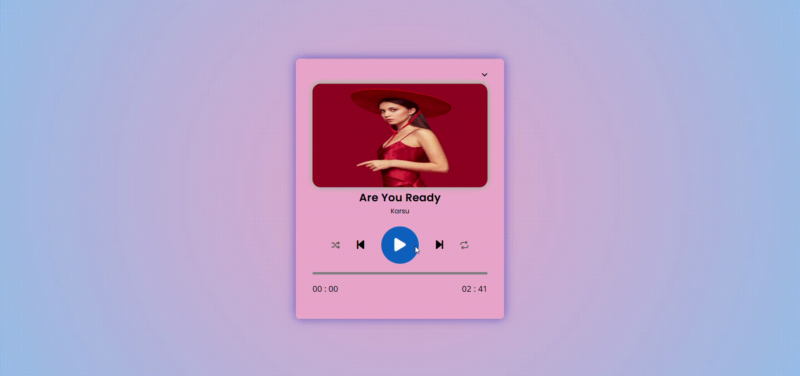

<h1>MP3 Clone 🎧</h1>
HTML,CSS ve JS kullanılarak oluşturulan bu proje yayında.
Bu proje, kullanıcıların müzikler arasında kolayca geçiş yapabileceği bir oynatma listesi deneyimi sunuyor.
Her ayrıntıyı düşünerek tasarladığım bu uygulama hem masaüstü hem de mobil cihazlarda kusursuz çalışıyor.

<h1>Proje Özellikleri ✨</h1>

🔹Modern ve Şık bir arayüz

🔹Responsive Dizayn 

🔹Listeleme: MP3 dosyalarınızı yönetebilir ve listeleyebilirsiniz.

🔹Şarkıları ileri ve geri sarma, durdurma ve başlatma seçenekleri mevcuttur.

🔹Kullanıcılar şarkıları sırasıyla veya rastgele çalma modunda dinleyebilir.

🔹Döngüleme ve şarkılar arasında geçiş yapma özellikleri mevcuttur.

<h1>Demo 📷</h1>

